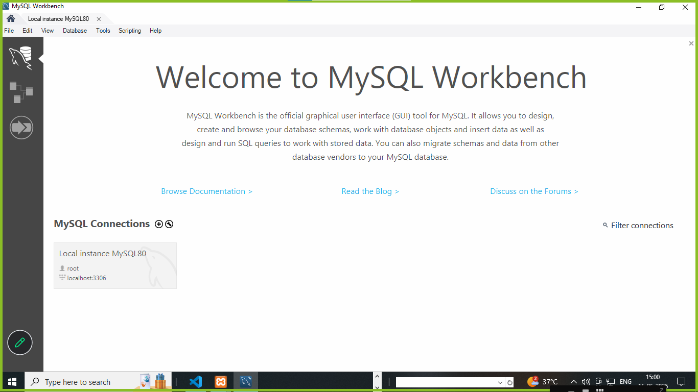
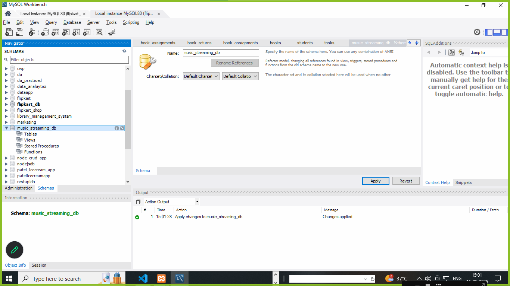

**assingments**

**Tasks**

1. Install MySQL Community Server on your computer and take a screenshot of the MySQL installer completion window.

solutions : 

 


2. Open MySQL Workbench or DB Browser, connect to your local MySQL server, and create a new database called music_streaming_db.

 
  **solutions**

  


3. Write the SQL command to create a new database named food_delivery_db and execute it in your SQL Workbench or DB Browser.<br><br><em><strong>Hint:</strong> Use the CREATE DATABASE statement.</em>
 
  **solutions**

 ```
  solutions :  create database  food_delivery_db;

 ```
   

4. List 3 differences between MySQL and PostgreSQL in terms of features or use cases, and give one example of a popular app or company that uses each.

  **solutions**

  **MYSQL**
  1. mySQL is open source database
  2. mySQL is handel SQL based database
  3. mySQL is based for small based applications 


  
  **postgre**

  1. postgre is open source database
  2. postgre is handel SQL based database
  3. postgre is based for large based applications 
  
  
  


