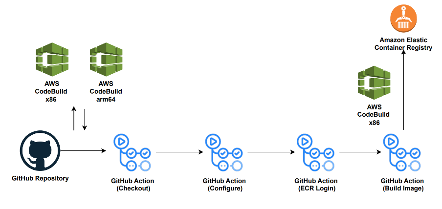
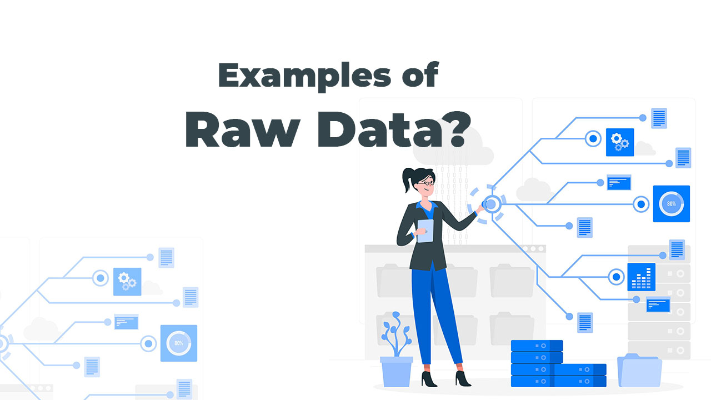

# what is data ?

  1. data is a collection of information i.e called data 
  2. data is an collection of information i.e called data

# types of data ?

  1. structured data 
  2. unstructured data
  3. raw data 

# what is structured data ?

  1. structured data stored data in column and row i.e called structured data

     ```
     table (column * row) 
     excel (column and cell)
     CSV   (comma seperated value )

     ```

   **examples of employee tables**

   | Employee ID | Name           | Department | Position           | Salary (USD) | Joining Date | Email                                                           |
| ----------- | -------------- | ---------- | ------------------ | ------------ | ------------ | --------------------------------------------------------------- |
| EMP001      | John Smith     | IT         | Software Engineer  | 75,000       | 2021-03-15   | [john.smith@company.com](mailto:john.smith@company.com)         |
| EMP002      | Sarah Johnson  | HR         | HR Manager         | 68,000       | 2020-07-10   | [sarah.johnson@company.com](mailto:sarah.johnson@company.com)   |
| EMP003      | Michael Brown  | Finance    | Accountant         | 62,000       | 2019-11-22   | [michael.brown@company.com](mailto:michael.brown@company.com)   |
| EMP004      | Emily Davis    | Marketing  | Marketing Lead     | 70,000       | 2022-01-05   | [emily.davis@company.com](mailto:emily.davis@company.com)       |
| EMP005      | David Wilson   | Sales      | Sales Executive    | 58,000       | 2021-09-18   | [david.wilson@company.com](mailto:david.wilson@company.com)     |
| EMP006      | Jessica Taylor | IT         | DevOps Engineer    | 80,000       | 2023-02-14   | [jessica.taylor@company.com](mailto:jessica.taylor@company.com) |
| EMP007      | Daniel Moore   | Support    | Support Specialist | 50,000       | 2020-05-30   | [daniel.moore@company.com](mailto:daniel.moore@company.com)     |
| EMP008      | Olivia Martin  | Design     | UI/UX Designer     | 66,000       | 2022-08-12   | [olivia.martin@company.com](mailto:olivia.martin@company.com)   |
| EMP009      | James Anderson | Operations | Operations Manager | 72,000       | 2018-12-03   | [james.anderson@company.com](mailto:james.anderson@company.com) |
| EMP010      | Sophia Thomas  | Legal      | Legal Advisor      | 85,000       | 2021-06-25   | [sophia.thomas@company.com](mailto:sophia.thomas@company.com)   |


# what is unstructured data

 1. unstructured data stored data in formate of text | audio | video | images etc i.e called unstructured type of data


 **examples of unstructured data**

 ```
  music.mp3
  music.mp4
  detailes.txt
  live.jpeg

 ```

 


# what is  raw data formate   

  1. raw data formate is in json, xml and object i.e called raw data formate

  **examples of raw data formate**

  ```
   employee.json
   salary.json
   object data raw formate data  
   or
   xml (xtensible markup language)

  ```


  


