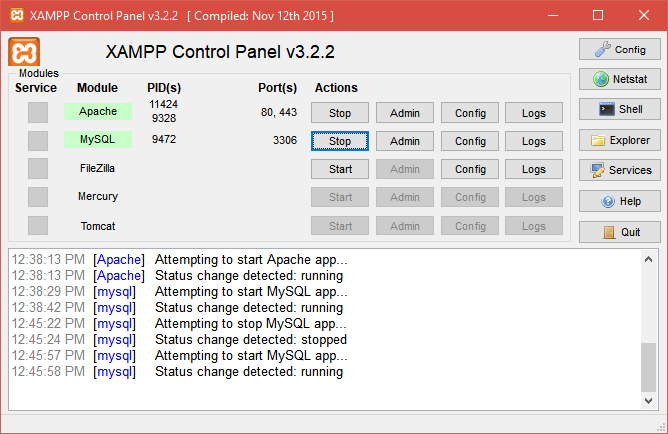

# what is SQL ?

SQL (Structured Query Language) is a standardized programming language used for managing and manipulating relational databases. It allows users to create, read, update, and delete data efficiently.

## Characteristics of SQL

1. SQL is a structured query language 
2. SQL is structured query based language 
3. SQL is used to create a database and tables structured
4. SQL will manage and provides relationship between tables  
5. SQL is case-insensitive language
6. SQL is most commonly used to create an structured database

## Advantages of SQL

1. **Easy to Learn** - SQL has a simple and intuitive syntax that resembles English, making it easy for beginners to learn

2. **Portability** - SQL works across different platforms and database systems (MySQL, PostgreSQL, Oracle, SQL Server, etc.)

3. **High Performance** - SQL efficiently handles large volumes of data and performs complex queries quickly

4. **Data Security** - SQL provides authentication and authorization mechanisms to protect sensitive data

5. **ACID Compliance** - SQL supports transactions with ACID properties (Atomicity, Consistency, Isolation, Durability)

6. **Data Integrity** - SQL enforces referential integrity and constraints to maintain data consistency

7. **Standardized Language** - SQL follows standardized syntax across most relational database systems

8. **Scalability** - SQL databases can handle growing volumes of data without performance degradation

9. **Flexibility** - SQL supports complex queries and multiple data retrieval methods 


# SQL commands or query 

1. SQL provides some query or commands 
2. SQL is case - insenstive 
examples : INSERT | insert | Insert
3. best way to write query in small case 

**types of SQL query**

1. DDL (data definition language)
2. DML (data manipulation language)
3. DQL (data query language)
4. TCL (Transactional query language)


# mysql start database 

1. xampp is a server tools 

X -cross plateform(support all OS)
A -apache (server)
M -MySQL (database)
P -Perl
P -php

**how to download xampp**

```
https://www.apachefriends.org/ 

``` 



localhost/phpmyadmin


# 2. mySQLworkBench2.0

MySQLworkbench is also used for mysql database 
MySQLworkbench is also used to create database | tables create 


**download and start**  

```
https://dev.mysql.com/downloads/file/?id=552199

```

# DDL (data definition language)

1. DDL is used to create a database and table structured 
2. DDL is also used to add | modify | rename any column name of table.
3. DDL also drop and truncate a structures 
4. DDL is also used to change the columnname of table 


**examples of DDL**

1. create 
2. alter 
3. rename 
4. drop 
5. change
6. truncate   

**How to create a database structured**

**syntax**

```
create database databasename;
or
create database flipkart_shop;

```

**How to create a table structures**

**chart of table to create fieldname and datatype and its size in SQL**

```

| Data Type    | Description           | Example             |
| ------------ | --------------------- | ------------------- |
| INT          | Whole numbers         | 1, 100              |
| BIGINT       | Large whole numbers   | 999999999           |
| VARCHAR(n)   | Variable-length text  | VARCHAR(0-255)      |
| CHAR(n)      | Fixed-length text     | CHAR(1)             |
| TEXT         | Long text             | Paragraph           |
| DATE         | Date only             | 2026-05-25          |
| DATETIME     | Date + time           | 2026-05-25 10:30:00 |
| DECIMAL(p,s) | Exact decimal numbers | DECIMAL(10,2)       |
| FLOAT        | Decimal numbers       | 12.5                |
| BOOLEAN      | True/False            | TRUE                |
| BLOB         | Binary data/files     | Images/files        |
| ENUM         | select multiple choice| multiple choices    | 


```

**syntax to create a table in SQL**
```
create table tablename
(
columnname1 datatype(size) auto_increment primary key,
columnname2 datatype(size),
.
.
.
.
.
)
```

**examples**

**create a employee tables**

```
create table employee
(
empid int primary key AUTO_INCREMENT,
name varchar(155),
password varchar(255),
email varchar(255),
phone bigint,
address text    

);

```

**create a reviews contact**

```
create table contact
(
contactid int primary key AUTO_INCREMENT,
name varchar(155),
email varchar(255),
subject ENUM('24x7 customer support','return product','customer care numbers'),
phone bigint,
message text    

);

```

**create a reviews tables**

```
create table reviews
(
reviewsid int primary key AUTO_INCREMENT,
name varchar(155),
email varchar(255),
ratings ENUM('1 star','2 star','3 star','4 star','5 star'),
phone bigint,
comment text    

);
```

**create a tables of products**

```
# Products Table Structure

| Column Name | Data Type | Size | Description |
|---|---|---|---|
| product_id | INT | 11 | Unique product ID |
| product_name | VARCHAR | 150 | Product name |
| product_code | VARCHAR | 50 | Product SKU/code |
| category_id | INT | 11 | Category reference ID |
| brand_name | VARCHAR | 100 | Brand name |
| price | DECIMAL | 10,2 | Product price |
| stock_quantity | INT | 11 | Available stock |
| weight | DECIMAL | 8,2 | Product weight |
| color | VARCHAR | 50 | Product color |
| size | VARCHAR | 20 | Product size |
| description | TEXT | Large Text | Product description |
| image_url | VARCHAR | 255 | Product image path/url |
| is_active | BOOLEAN | — | Product active status |
| created_at | DATETIME | — | Record creation time |
| updated_at | DATETIME | — | Last updated time |

```

# SQL Create Table Query

```
CREATE TABLE products (
product_id INT PRIMARY KEY AUTO_INCREMENT,
product_name VARCHAR(150) NOT NULL,
product_code VARCHAR(50) UNIQUE,
category_id INT,
brand_name VARCHAR(100),
price DECIMAL(10,2) NOT NULL,
stock_quantity INT DEFAULT 0,
weight DECIMAL(8,2),
color VARCHAR(50),
size VARCHAR(20),
description TEXT,
image_url VARCHAR(255),
is_active BOOLEAN DEFAULT TRUE,
created_at DATETIME DEFAULT CURRENT_TIMESTAMP,
updated_at DATETIME DEFAULT CURRENT_TIMESTAMP
);

```

# alter 
1. alter is used to add new columns in tables
2. alter is used to modify or change  columns name in tables
3. alter is used to drop  columns name in tables

```
alter is used to add | modify | update | drop a columns from table 

1. alter table employee add added_date date;
2. alter table employee add is_Active boolean DEFAULT TRUE;
3. alter table employee add photo blob after email;
4. alter table employee CHANGE name employeename varchar(255)
5. alter table employee drop photo;

```


# rename : after create tables we rename the tables name

```
rename table reviews to flip_reviews

```


# drop : is drop database and tables both after drop we can not rollback anything 

**drop database**

```

drop database databasename;

or

drop database flipkart_shop

```

**drop table**

```

drop table tablename;

or

drop table flip_contact

```


**truncate**

```
truncate delete data or cleared data from table 
after truncate we can not rollback or undo the data 
after truncate it cleared all data 
truncate can not effects on structured its only delete data

syntax ..
truncate table tablename
or
truncate table reviews

```

**rename**

```
rename is used to rename the table
syntax :
rename table tablename to newtablename
or
rename table employee to tbl_employee
or
rename table reviews to tbl_reviews
```


**change**

```
change is used to change any columname in table 
syntax :
alter table tablename change columnname newcolumnname datatype(size);
or
alter table tbl_employee change password employee_password varchar(255);
```

# what is DML ....  Data manipulation language

1. stands for data manipulation language 
2. DML used to manipulate data meanse insert | delete | update data in tables 
3. DML data 

a. insert 
b. delete 
c. update 

**how to insert a single or multiple data in tables**

1. insert a single row in table

```
syntax :

insert into tablename(columnname1, columnname2) values ('value1','value2');
or

insert into tbl_reviews(name,email,phone,rating,comment,added_date) values ('om','om@gmail.com',91212121,'5 star','good i am glad to here','19-05-2026') 

```


2. insert a multiple rows in table

```
syntax :

insert into tablename(columnname1, columnname2) values ('value1','value2'),('value1','value2'),('value1','value2');
or

insert into tbl_reviews(name,email,phone,rating,comment,added_date) values ('amish','amish@gmail.com',91212178,'5 star','good i am glad to here','2026-05-19'),('kirtan','kirtan@gmail.com',93212178,'5 star','good i am glad to here','2026-05-19'),('mahesh','mahesh@gmail.com',95212178,'5 star','good i am glad to here','2026-05-19') 

or

insert into tbl_reviews values('null','naimish','naimish@gmail.com',91212178,'5 star','good i am glad to here','2026-05-19'),('null','ritesh','ritesh@gmail.com',93212178,'5 star','good i am glad to here','2026-05-19'),('null','kumar','kumar@gmail.com',95212178,'5 star','good i am glad to here','2026-05-19')

```

# how to delete data 

1. delete data is used to delete a data 
2. delete is also used to delete a particular one rows 
3. delete is also used to delete with its columnname 
4. delete is also used to delete a range of data 
5. delete is also used to delete alternate data 

**examples of delete**

```
delete from tablename
or 
delete from tbl_reviews
or 
delete from tbl_reviews where id=5;
or
delete from tbl_reviews where name='om';
or
delete from tbl_reviews where id between 5 and 10;
or
delete from tbl_reviews where id in(12,14,16,19)
```   

# how to delete data or rows 

1. update a rows ...

```
update tablename set colunname='value' where id;
or
update tbl_reviews set name='om',email='om007@gmail.com',phone=635898956,rating='5star',comment='good to see you',added_date='2026-05-21' where id=17;
or
update tbl_reviews set name='om',email='om007@gmail.com',phone=635898956,rating='5star',comment='good to see you',added_date='2026-05-21' where id=17;

or

update tbl_reviews set email='bkpandey.pandey@gmail.com' where id=1;

or

update tbl_reviews set email='bkpandey.pandey@gmail.com' where id=1;

or

update tbl_reviews set email='mukeshdhandhukiya007@gmail.com' where name='mukesh';   

```
# DQL ..stands for data query language 

1. DQL stands data query language 
2. DQL is used to select or fetch data 
3. DQL is only used select query or command

**select examples**

```
select * from tbl_reviews;
or
select * from tbl_reviews id=1;
or
select * from tbl_reviews where id=1;
or
select * from tbl_reviews where between 18 and 25;
or
select * from tbl_reviews where id in(13,17,20);
or
select id,name,email,phone from tbl_reviews;
or
select * from tbl_reviews where id limit 1,6;


```

**order by and group by**


# order by :

1. order by filter data from tables in ascending or descending order
2. order by is used to sort data in ascending or descending order

**syntax**

```
select * from tablename order by columnname asc;
or
select * from tablename order by columnname desc;

examples :
select * from flip_reviews order by name asc;
or
select * from flip_reviews order by name desc;
or
select * from flip_reviews order by id desc;
or
select * from flip_reviews order by id asc;
```

SQL function :

1. SQL function is used to perform some operations on data and return a single value
2. SQL function is used to perform some operations on data and return a single value

# types of SQL function

1. aggregate function

1. sum(): returns the total sum of a numeric column

examples : select sum(salary) from flip_employee;
or
select sum(salary) as sumofsalary_ofemployee from flip_employee;  

**as is used to give alias name to columnname or table name**

2. avg(): returns the average value of a numeric column

examples : select avg(salary) from flip_employee;
or
select avg(salary) as avgsalary_ofemployee from flip_employee;

3. count(): returns the number of rows that match a specified condition

examples : select count(*) from flip_employee;
or
select count(*) as totalemployee from flip_employee;
or
select count(salary) from flip_employee where salary>16000;

4. max(): returns the maximum value of a column
examples : select max(salary) from flip_employee;
or
select max(salary) as maxsalary_ofemployee from flip_employee;

5. min(): returns the minimum value of a column

examples : select min(salary) from flip_employee;
or
select min(salary) as minsalary_ofemployee from flip_employee;


**note : aggregate function is used to perform some operations on data and return a single value**


2. scalar function

1. firstname() : returns the first name of a person
2. lastname() : returns the last name of a person
3. length() : returns the length of a string
4. upper() : returns the string in uppercase
5. lower() : returns the string in lowercase
6. round() : rounds a numeric field to the number of decimals specified
7. now() : returns the current date and time


examples : select firstname(employeename) from flip_employee;
or
select lastname(employeename) from flip_employee;
or
select length(employeename) from flip_employee;
or
select ucase(name) from flip_employee;
or
select lcase(emplyeename) from flip_employee;
or
select round(salary,2) from flip_employee;
or
select now() from dual;

**note : scalar function is used to perform some operations on data and return a single value**

firstname() and lastname() function is used to return the first name and last name of a person from a full name column not supported in mysql but supported in sql server and oracle database


# group by 

1. group by is used to group data based on a column
2. group by is used to group data based on a column and perform aggregate functions like

- count
- sum
- avg
- max
- min

**syntax**

```
select sum(salary) from flip_employee group by department;
or
select department, sum(salary) from flip_employee group by department;
or
select sum(salary),department from flip_employee GROUP by department;
or
select sum(salary) as totalsalary,department from flip_employee GROUP by department;

```

# w.a.q to find second highest salary from employee table

**subquery**

1. query within another query is called subquery
2. subquery is used to find second highest salary from employee table

```
select max(salary) from flip_employee where salary < (select max(salary) from flip_employee);   
or
select salary from flip_employee order by salary desc limit 1,1;
or
select salary from flip_employee order by salary desc limit 2,1;

```
# like operator 

1. like operator is used to search for a specified pattern in a column
2. like operator is used to search for a specified pattern in a column using wildcards

**wildcards**

1. % : represents zero or more characters
2. _ : represents a single character
3. [ ] : represents any single character within the brackets
4. [^] : represents any single character not within the brackets
5. - : represents a range of characters
6. | : represents an OR condition
7. \ : escape character
8. ^ : represents the start of a string
9. $ : represents the end of a string
10. () : groups a series of conditions

**syntax**

```
select * from tablename where columnname like 'pattern';
or
select * from flip_employee where employeename like 'a%'
or
select * from flip_employee where employeename like '%v'
or
select * from flip_employee where employeename like '%a%'
or
select * from flip_employee where employeename like '_a%'
or
select * from flip_employee where employeename like 'a_%';
or
select * from flip_employee where employeename like 'a__%';
or
select * from flip_employee where employeename like '%bri%'
or
select * from flip_employee where employeename like '%or%'

```

# key constraints in SQL ......

1. key constraints are used to provide a limitation on a  tables 
2. key constraints are ...

1. primary key 
2. unique key 
3. foreign key  

# primary key :

1. A pk key never return a null values 
2. A pk key always have an auto_increments 
3. A pk will provides only one times in tables
4. A pk stored a unique values 

**create table with pk**

```
create table reviews
(
reviewsid int primary key AUTO_INCREMENT,
name varchar(155),
email varchar(255),
ratings ENUM('1 star','2 star','3 star','4 star','5 star'),
phone bigint,
comment text    

);

```

**create in md formate**

# Reviews Table Structure

| Column Name | Data Type | Size / Values | Constraints |
|------------|-----------|---------------|-------------|
| reviewsid | INT | - | PRIMARY KEY, AUTO_INCREMENT |
| name | VARCHAR | 155 | NULL Allowed |
| email | VARCHAR | 255 | NULL Allowed |
| ratings | ENUM | '1 star', '2 star', '3 star', '4 star', '5 star' | NULL Allowed |
| phone | BIGINT | - | NULL Allowed |
| comment | TEXT | Large Text | NULL Allowed |


# unique key :

1. A uk key return one times a null value   
2. A uk will provides many times in a tables on columns
3. A uk stored a unique values
4. A uk never stored an dublicate values in tables 

**create table with uk**

```
ALTER TABLE `flip_register` ADD UNIQUE(`email`);
or
ALTER TABLE `flip_register` ADD UNIQUE(`phone`);
```

**note : here email and phone are unique key set and it is never stored a dublicate values**  

# foreign key :

1. A fk will provides many times in a tables on columns with common field or column
3. A fk are used to provides an relationship b/w one table to another table
4. A fk can stored an dublicate key with common field

**create table with fk**

# create a flip_country table

```
create table flip_country
(
cid int AUTO_INCREMENT primary key,
countryname varchar(255)    
)
```

# create a flip_users table 

```
create table flip_users
(
uid int AUTO_INCREMENT primary key,
name varchar(255),
email varchar(255),
phone bigint,
cid int REFERENCES flip_country(cid)    
)

```
# create an tables with foreign key ....

# ecommerce managements

# create an database flipkart_shop

1. flip_category
2. flip_subcategory
3. flip_products 
4. flip_customers
5. flip_cart
6. flip_orders

# examples:
```
1. create database flipkart_shop
2.create table flip_category
(
catid int AUTO_INCREMENT primary key,
categoryname varchar(255)   
)
3.create table flip_subcategory
(
pid int AUTO_INCREMENT primary key,   
catid int REFERENCES flip_category(catid),
subcategoryname varchar(255)
) 
4.create table flip_products
(
pid int AUTO_INCREMENT primary key,   
catid int REFERENCES flip_category(catid),
subcatid int REFERENCES flip_subcategory(subcatid),
pname varchar(255),
qty int,
oldprice int,
photo blob,   
offerprice int,
descriptions text   
)  

5. create table flip_customers
(
custid int primary key AUTO_INCREMENT,
name varchar(255),
email varchar(255),
password varchar(255),
address text,
phone bigint    

)

6. create email as unique key 

alter table flip_customers add unique(`email`)

7. create table flip_cart
(
cartid int AUTO_INCREMENT primary key,
pid int REFERENCES flip_products(pid),
custid int REFERENCES flip_customers(custid),
qty int, 
price int, 
suntotal int, 
added_date varchar(255)    
)
```
# students managements  systems

1. courses
2. faculty
3. students

# task managements 

1. flip_priority
3. flip_employee 
2. flip_task


# ecommerce related tables normalisations ...

1. create table categories
(
catid int AUTO_INCREMENT primary key,
catname varchar(255)
)

2. create table subcategories
(
subcatid int AUTO_INCREMENT primary key,
subcatname varchar(255)
)

3. create table flip_products
(
pid int AUTO_INCREMENT primary key,   
catid int REFERENCES flip_category(catid),
subcatid int REFERENCES flip_subcategory(subcatid),
pname varchar(255),
qty int,
oldprice int,
photo blob,   
offerprice int,
descriptions text   
) 


# students managements systems database normalisations 

1. priority
2. employee
3. task 


# SQL join .....

join ...

# join is used to join more than once table with common field if data matched from one table to another table its join 


1. join 


```
select products.*,catname,subcatname from products join categories on products.catid=categories.catid join subcategories on products.subcatid=subcategories.subcatid;
or

select pid, photo,pname, offerprice, descriptions, added_date_time, catname,subcatname from products join categories on products.catid=categories.catid join subcategories on products.subcatid=subcategories.subcatid;
or

select task.*, pname,name from task join priority on task.prid=priority.prid join employee on task.empid=employee.empid


or

select taskid, title, added_date,pname,name from task join priority on task.prid=priority.prid join employee on task.empid=employee.empid 

```

# students managements  systems

1.create table course
(
courseid int AUTO_INCREMENT primary key,
coursename varchar(255)    
) 
2. create table faculty
(
facultyid int AUTO_INCREMENT primary key,
facultyname varchar(255)    
) 
3.create table students
(
sudentid int AUTO_INCREMENT primary key,
name varchar(255),
age int, 
address text,
enrollment int,
courseid int REFERENCES course(courseid),
facultyid int REFERENCES faculty(facultyid)
) 


# Query 

1. select coursename only bfrom table course
2. select facultyname as staffname from table faculty
3. select students table with coursename and facultyname 
4. select coursename all in uppercase 

# solutions    


```
select coursename from course;
or
select ucase(coursename) from course;
or
select facultyname as staffname from faculty;
or
select ucase(facultyname) as staffname from faculty;
or
select sudentid,name,age,address,coursename,facultyname from students join course on students.courseid=course.courseid join faculty on students.facultyid=faculty.facaltyid

```

# user managements systems 

1. country 
2. state 
3. city 
4. users 


# question 

1. select only country name from country table in uppercase 
2. select only state name from state table in uppercase 
3. select only cityname name from city table in uppercase 
4. select uid,uname,salary,countryname,statename,cityname from users (apply join in users table  to get all name of country , state and city)


## Note : create users table wth normalisation and provides cid, sid and ctid as foreign key 

# Types of join ...

**There are 4 types of join**

1. join 
2. inner join 
3. outer join 
1. left join 
2. right join 
3. full join 
4. cross join   

# what is join ?

1. join is used to join more than one column data with common filed if data matched one table to another tables 

**department**

|depid(pk)|   depname |
|-------- |-----------|
|  1      |   IT      |
|  2      |   CSE     |
|  3      |   HR      |
|  4      |   Finance |
|  5      |   Bank    |

**employee**

| empid  | empname | age  | salary | depid(fk) |
|--------|---------|------|--------|-----------| 
|  1     | forum   | 21   | 15500  |  1        | 
|  2     | faiz   | 20   | 18500  |  1        | 
|  3     | manan   | 22   | 125500  |  1        | 
|  4     | ashtha   | 23   | 115500  |  2        | 
|  5     | brijesh   | 35   | 17500  |  1        | 
|  6     | pranav   | 22   | 16500  |  2       |   


# inner join :

1. inner join is same as join if data matched from one tables to another tables it will be join otherwise return null values 

```
select  flip_employee.*,depname  from flip_employee inner join  flip_department on flip_employee.depid=flip_department.depid; 

```


# outer join 

1. left join : 

left join are used to join first table of left rows to second table of left rows if data matched join all data other wise return null values.

```
select  flip_employee.*,depname  from flip_employee left join  flip_department on flip_employee.depid=flip_department.depid;

```

2. right join : 

right join are used to join second table of right rows to first table of right rows if data matched join all data otherwise return null values.

```
select  flip_employee.*,depname  from flip_employee right join  flip_department on flip_employee.depid=flip_department.depid;

```


3. full join : left join + right join 

# mysql is not supported  


# cross join :

cross join are used to join one tables of data with another tables with cross of numbers of total data..

examples :  select * from flip_employee cross join flip_department

# note : finance company or markeiting company chain marketing

A 
B     C                  D               E        
F        E     G     I     J    F E G I J       F E G I J        F E G I J
F E G I J     F E G I J   F E G I J   F E G I J   F E G I J   F E G I J  F E G I J


# Question : write a query to create departments tables and insert 4 rows or data
# Question : write a query to fetch only depname in uppercase or lowercase
# Question : write a query to fetch only depname in decending order 
# Question : write a query to fetch employee details who's salary is second highest
# Question : write a query to fetch only details of empid 3,5,2 employee details 
# Question : write a query to fetch only employee details who's name start with 'f' character
# Question : write a query to fetch deprtmentname inside of employee tables with join query 


# Answer .....

1. create table flip_department
(
depid int primary key AUTO_INCREMENT,
depname varchar(255)    

)
2. insert into flip_department(depname) values('IT'),('CSE'),('HR'),('BANK') 

3. select lcase(depname) from flip_department

4. select * from flip_department order by depname desc;

5. create table flip_employee
(
empid int primary key AUTO_INCREMENT,
depid int REFERENCES flip_department(depid),
name varchar(255),
age int,
phone bigint,
salary float,
added_date date

)

6. select * from flip_employee order by salary desc limit 1,1;
7. select flip_employee.*,depname from flip_employee join flip_department on flip_employee.depid=flip_department.depid;

8. select empid,name,age,phone,salary,depname from flip_employee join flip_department on flip_employee.depid=flip_department.depid order by salary desc limit 1,1;

9. select empid,name,age,phone,salary,depname from flip_employee join flip_department on flip_employee.depid=flip_department.depid order by salary desc limit 0,1;

10. select * from flip_employee where empid in(3,5,2);

11. select * from flip_employee where empid between 3 and 6;

12. select * from flip_employee where name like 'f%';

13.  select flip_employee.*,depname from flip_employee join flip_department on flip_employee.depid=flip_department.depid;


# task based query 

# Part 1: The Environment Setup

# Run this script in your SQL editor to create the sandbox.
**SQL**

CREATE TABLE Users (
user_id INT PRIMARY KEY,
name VARCHAR(100),
email VARCHAR(100),
signup_date DATE,
country VARCHAR(50)
);
CREATE TABLE Products (
product_id INT PRIMARY KEY,
name VARCHAR(100),
category VARCHAR(50),
price DECIMAL(10,2),
stock_count INT
);
CREATE TABLE Orders (
order_id INT PRIMARY KEY,
user_id INT,
order_date DATE,
status VARCHAR(20),
FOREIGN KEY (user_id) REFERENCES Users(user_id)
);

CREATE TABLE Order_Items (
item_id INT PRIMARY KEY,
order_id INT,
product_id INT,
quantity INT,
unit_price DECIMAL(10,2),
FOREIGN KEY (order_id) REFERENCES Orders(order_id),
FOREIGN KEY (product_id) REFERENCES Products(product_id)
);

Part 2: The 100 Questions (2-Hour Timer)

The Basics (Questions 1–20)

1. Select all columns from the Users table.
2. List the names of all products in the 'Electronics' category.
3. Find all users who signed up in 2023.
4. List products with a price greater than $500.
5. Find all orders with a 'Pending' status.
6. Select the email of the user with user_id 10.
7. List all unique countries in the Users table.
8. Find products where the name starts with 'S'.
9. Get the top 5 most expensive products.
10. Find all orders placed in January 2024.
11. List users whose name contains 'John'.
12. Find products with stock_count between 10 and 50.
13. Get all orders from users in 'USA'.
14. List products sorted by price (lowest to highest).
15. Count the total number of users.
16. Find all products that are NOT in the 'Clothing' category.
17. List orders sorted by order_date descending.
18. Find users who signed up before 2022.
19. Get the names of products that cost exactly $99.99.
20. Show the first 10 rows of the Order_Items table.


# SQL Normalizations 

1. SQL normalisation is used to removed redundancy of data format
2. SQL normalisation is used to removed dublicacy data formate there we used normalisation 
3. types of normalisation 

1) 1 NF 
2) 2 NF 
3) 3 NF
4) 4 NF
5) 5 NF 

1. 1 NF : 1st NF is only descrived any tables with primary key and auto_increments

**examples**

|depid(pk)|   depname |
|-------- |-----------|
|  1      |   IT      |
|  2      |   CSE     |
|  3      |   HR      |
|  4      |   Finance |
|  5      |   Bank    |            


2. 2 NF : 2ND NF is  used to create 2 tables and provides relationship between them i.e called 2nd NF form with foreign key.

**examples**

**departments**

|depid(pk)|   depname |
|-------- |-----------|
|  1      |   IT      |
|  2      |   CSE     |
|  3      |   HR      |
|  4      |   Finance |
|  5      |   Bank    |            


**employee**

| empid  | empname | age  | salary | depid(fk) |
|--------|---------|------|--------|-----------| 
|  1     | forum   | 21   | 15500  |     1     | 
|  2     | faiz   | 20   | 18500   |     1     | 
|  3     | manan   | 22   | 125500 |     1     | 
|  4     | ashtha   | 23   | 115500|     2     | 
|  5     | brijesh   | 35   | 17500|     1     | 
|  6     | pranav   | 22   | 16500 |     2     |   


3. 3rd NF : 

create 5 tables and normalised via pk | fk | uk and give relationship with all i.e called 3rd normalisation 


**examples**

**category**

catid         catname 

**subcategory**

subcatid   catid   subcatname

**products**

pid catid subcatid  pname qty  price desc status 

**customers**

custid   name   age    address   status 

**cart**

cartid pid  catid  subcatid   custid   subtotal   status   added_date


# what is view in SQL ? 

1. view is used to create for any tables 
2. view is used to create a dublicate tables or virtual tables 
3. view is create a clone of our  original tables 
4. view is used to create to hide some data from some users so we can create views of that tables 

syntax :  

```
create view viewname as select  columnname1 , columnname2 , columnname3 from tblname where id=1

or 

create view flip_employee_view as select empid, name , age , salary, added_date from flip_employee where empid=3;

```      
# note :   

1. we can also insert | delete | update and alter any data from original tables  its also effects on its virtuals  tables 

2. insert into flip_employee_view (name,age,salary,added_date) values('kumar',32,45500,'2026-06-12')

3. delete from flip_employee_view where empid=7;

4. delete from flip_employee where empid=3;


# what is index in SQL ? 

1. SQL index  is used to create for improved the speed or performance of tables there we create an index or indexer 

2.SQL indexer create on single columns or multiples columns of tables 

3. SQL indexer create multiple columns composite indexer 

4. if we create only one columns an indexer its create a sigle indexer 

5. indexer is used to improved performance or speed or fast lookup data from tables so we can create an indexer of table.

# syntax of create indexer ...

```
create index indexname on tablename (columnname1, columnname1, columname2....)
or
create index flip_index_employee on flip_employee (empid, name, age, phone)
```
# TCL ....

1. trasnactional control language 
2. TCL is used to commit | rolback | save point data after delete from tables 
3. TCL is based to support in oracle database 

**types of query in TCL**

1. save point 
2. commit 
3. rollback  

1. save point .......

1. start TCL will be applied save point it is save the query before executions ....

```
start TRANSACTION;
delete from course where courseid=5;
SAVEPOINT;

```

2. commit is used to save any query before delete it there we applied commit


```
start TRANSACTION;
delete from course where courseid=5;
commit;

``` 

3. rollback is used to rollback a data after delete in TCL 

```

start TRANSACTION;
select * from course where courseid=5;
rollback;

```


**note : TCL save point and commit and rollback it is best to support in oracle database**

# mySQLworkbench ................

user : root
pass : admin

SQL workbench integerate ....

DDL
DML
DQL 
TCL

```  
INSERT INTO `flipkart_db`.`customers` (`id`, `name`, `password`, `mobile`, `address`) VALUES ('4', 'mitesh', 'm562121', '9121212121', 'ghandhinagar');

```


# SQL windows functions .....

1. SQL windows functions is used to applied calculation | add unique rows to current rows in a tables 

2. SQL windows functions are used to add or set a rows related to the current row without grouping the result into a single row 


# types of function of windows 


1. ROW_NUMBER()

2. RANK()

3. DENSE_RANK()

4. NTILE()

5. LAG()

6. LEAD()

7. FIRST_VALUE()

8. LAST_VALUE()

9. SUM() OVER()

10. AVG() OVER()

11. MIN() OVER()

12) MAX() OVER()

13) COUNT() OVER()


# create a tables employee ....  

1. create table name with flip_employee

2. ROW_NUMBER(): assingns a unique number to each rows 

```
select name , salary , ROW_NUMBER() OVER(order by salary desc) from flip_employee  

```

3. RANK() : provides ranking with gaps for dublicate values 

```
select name, salary, RANK() OVER(order by salary desc) as rank_no from employee;  
```

4. provides ranking without gaps for dublicate values 

```
select name, salary, DENSE_RANK() OVER(order by salary desc) as rank_no from employee;

```

5. NTILE() : divides rows into equal group 

``` 
select name, salary, NTILE(3) OVER(order by salary desc) as group_no from flip_employee;
```

6. LAG() : return previous rows values 

```
select name, salary , LAG(salary, 1) OVER(order by salary desc) as prevoius_salary from flip_employee; 
``` 

7. LEAD() : return next row value 

```
select name, salary , LEAD(salary, 1) OVER(order by salary desc) as prevoius_salary from flip_employee;   

```

8. FIRST_VALUES() : return first values in windows 

```
select name, salary , FIRST_VALUE(salary) OVER(order by salary desc) as prevoius_salary from flip_employee; 
``` 


8. LAST_VALUES() : return last values in windows 

```
select name, salary , LAST_VALUE(salary) OVER(order by salary desc) as LAST_VALUES_SALARY from flip_employee; 

``` 

9. SUM() : running with total in windows 

```
select name, salary , SUM(salary) OVER(order by salary) as total_sum_SALARY from flip_employee; 

```


9. AVG() : running with avg in windows 

```
select name, salary , AVG(salary) OVER(order by salary) as average_salary from flip_employee; 

```

10. MIN() OVER(): minimum values in windows

```
select name, salary , MIN(salary) OVER(order by salary) as MIN_SALARY from flip_employee;      

```


10. MAX() OVER(): maximum values in windows

```
select name, salary , MAX(salary) OVER(order by salary) as MAX_SALARY from flip_employee;      

```

11) COUNT() OVER() : count rows of windows

```
select name, salary , COUNT(empid) OVER(order by empid) as COUNT_EMPLOYEE from flip_employee;    
```    

# SQL WITH Clause

The SQL WITH clause (Common Table Expression or CTE) defines a temporary result set that can be used within a query. It simplifies complex SQL statements, making them easier to read, manage and reuse. 


```
WITH AvgSalaryCTE (averageValue) AS (
SELECT AVG(Salary)
FROM flip_employee
)
SELECT 
empid,
name, 
salary 
FROM 
flip_employee 
WHERE 
Salary > (SELECT averageValue FROM AvgSalaryCTE);

```      