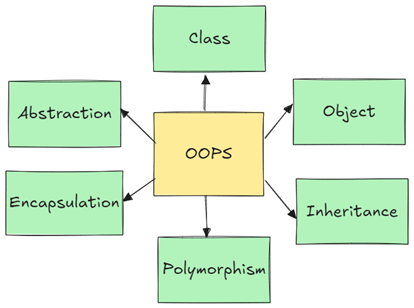

# what is oops ?
  1. oops stands for object oriented programming structured language
  2. oops is used in advanced python 
  3. oops is used as provides security in applications
  4. oops provides class | object | inheritance base structured 
  5. oops basically used in python in web developments 

# oops features ? 

  - oops provides some features that are ..
  1. class 
  2. object 
  3. inheritance
  4. polymorphism
  5. abstraction
  6. encapsulation 

# oops architectures in python 

# advantages of oops 

1.  oops is provides securities 
2.  oops provides access one class properties b y another class 
3.  oops provides data hiding procedures
4.  oops provides data securties proceedures 
5.  oops access data members by its properties 

