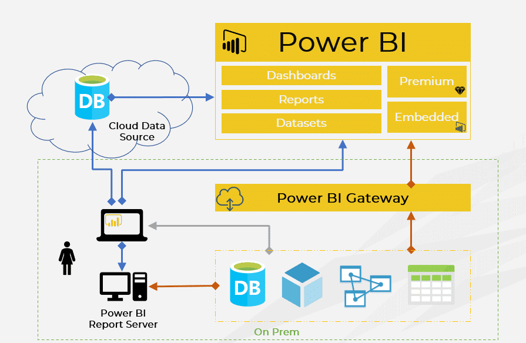

# what is power BI and its setup ?
# what is power BI ? 
  1. power BI it is a tools
  2. Power BI is used for data visualization 
  3. Power Bi is strogest tools for data visulization
  4. Power bi create a dashboard for data visulization
  5. Power BI developed and manage by microsoft 
  6. POwer BI is open source tools (free)

 # advantage of using power BI ? 

  1. power BI import max data set of data
  2. clean data 
  3. Transform data  
  4. create relationship 
  5. create chart and reports 
  6. publish your report
  7. sharing report 
  8. create a dashboard for data visualization
  9. download and install power
  10. power BI easily import data of .csv or .xlsx 
  11. power BI should connect with mysql or mysqlworkbench8.0


# how to download and install power BI 

 step - 1 officials microsoft website visit  

   ```
   https://www.microsoft.com/en-us/download/

   ```
 step -2  download and open power BI from start menu 

 step -3 its workspace are open 

 step -4 connect or import your .xlsx data or csv data 

 step -5 connect mysql in powerBI


**power BI basic structures**





**power BI basic structures**


                    POWER BI DESKTOP
                           |
        +------------------+------------------+
        |                  |                  |
   Get Data          Power Query         Data Model
        |                  |                  |
        +------------------+------------------+
                           |
                          DAX
                           |
                    Visualizations
                           |
                        Report
                           |
                    Publish to Service
                           |
                    Power BI Service


                    
